# TRAUMVEREIN – Der Fußballmanager

Samstagabend, Fanfare, Bauchbinde. Ein Fußballmanager im Geist von **Anstoss 1/2**:
Managerbüro, Aktenschrank, Vorstand, Presse – und ein Reporterton, der ein 0:0 in
Uerdingen ernst nimmt.

Mit einem Dreh, den es so nicht gibt: **Jeder Verein tritt mit seiner historisch stärksten
Elf an – zusammen mit dem aktuellen Kader.**

### ▶ [Jetzt im Browser spielen](https://grundhofer.github.io/traumverein/)

Keine Installation, kein Konto, kein Download. Der Spielstand bleibt in Ihrem Browser.

Lieber offline? Es gibt das ganze Spiel als **eine einzige HTML-Datei** unter
[Releases](https://github.com/grundhofer/traumverein/releases/latest) – herunterladen,
doppelklicken, spielen. Kein Node, kein npm, kein Server.

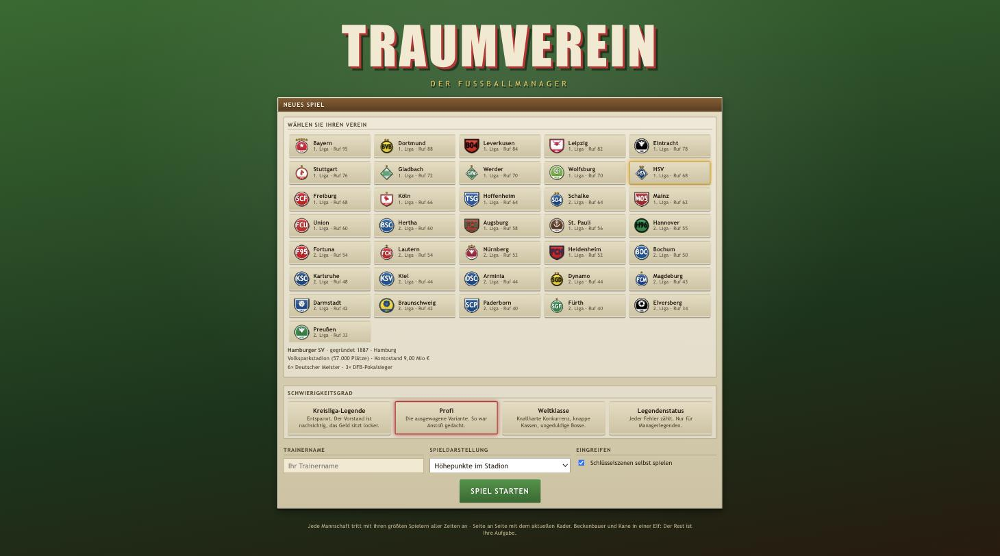
*36 Vereine aus beiden Profiligen, vier Schwierigkeitsgrade, drei Wege, ein Spiel zu erleben.*

---

## Beckenbauer neben Kane

Bei Bayern verteidigt Franz Beckenbauer neben Harry Kane, bei Gladbach dirigiert Günter
Netzer, beim HSV stürmt Uwe Seeler. **864 handgepflegte Spieler in 36 Kadern**, je 24 Mann,
rund 41 % davon Legenden – jede mit dem Etikett ihrer Ära („Ära 1974", „Ära 1997").

Die Generationen müssen sich erst finden: Die Chemie zwischen Legenden und modernen
Spielern ist zu Beginn schlechter und wächst mit gemeinsamer Spielzeit. Neun Legenden in
der Startelf sind kein Geschenk, sondern eine Rechnung.

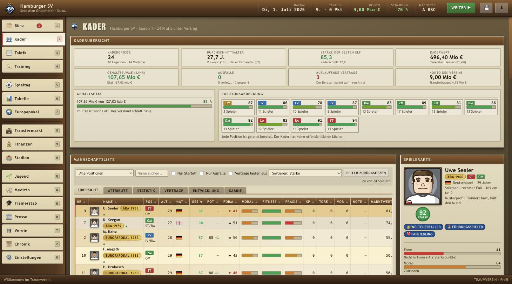
*Uwe Seeler, Stärke 92, „Ära 1966" – Weltfußballer, Führungsspieler, Fanliebling.*

**Das gilt in beiden Profiligen.** Auch die 2. Bundesliga ist von Hand geschrieben: Toni
Turek hält für Fortuna, Robert Enke für Hannover 96, Oliver Kahn für den KSC, Torsten
Mattuschka zaubert für Union, Ivan Klasnic trifft für St. Pauli. Wer absteigt, landet
deshalb nicht in einer Welt aus Zufallsnamen, sondern zwischen Vereinen, die selbst schon
Deutscher Meister waren.

---

## Der Spieltag

Vor dem Anpfiff steht der Vorbericht: beide Aufstellungen, Spielumfeld, Wetter, Rasen –
und die Akte des Schiedsrichters, samt Einschätzung des Co-Trainers, wie streng er heute
pfeift.

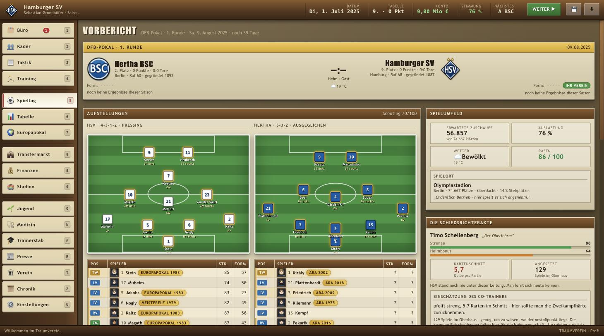

### Drei Wege, ein Spiel zu erleben

1. **Textkonferenz** – nur der Live-Ticker, schnell durch die Saison.
2. **Höhepunkte** – das Stadion zeigt Tore, Großchancen und Karten.
3. **Ganzes Spiel** – die komplette Partie in der Vogelperspektive.

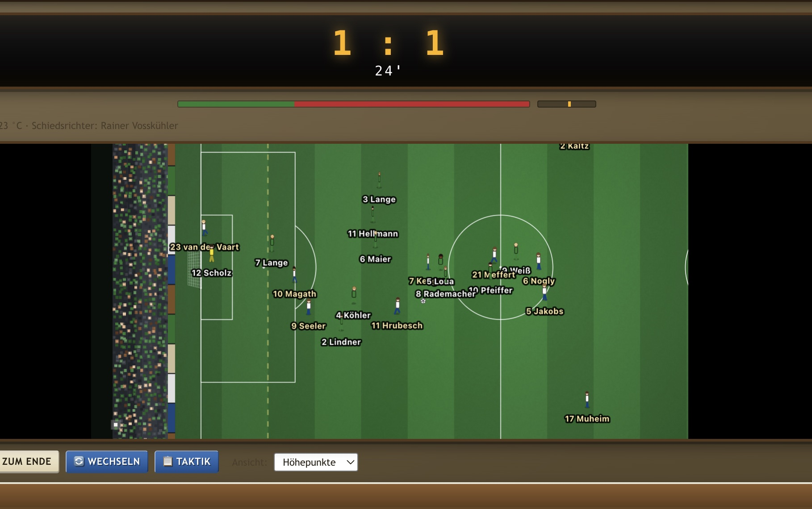
*Jeder Mann mit Namen: Seeler, Magath und Hrubesch, 24. Minute, 1:1.*

### Selbst eingreifen

Bei Elfmetern, Freistößen, Ecken, Torabschlüssen und Kombinationen im letzten Drittel
übernehmen Sie die Rolle des Schützen oder Passgebers. Geschick hilft – aber die
Fähigkeiten des Spielers bleiben maßgeblich, und die Zahl am Knopf sagt Ihnen vorher, wie
gut diese Chance wirklich ist. Jede Szenenart lässt sich einzeln abschalten, `ESC`
überlässt die Szene jederzeit der Simulation.

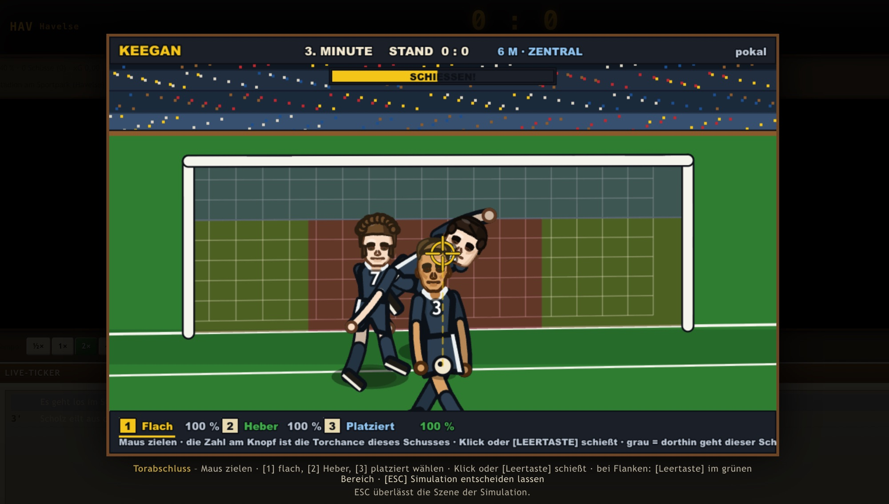
*Der Torabschluss: flach, Heber oder platziert – Keegan, 6 Meter, zentral.*

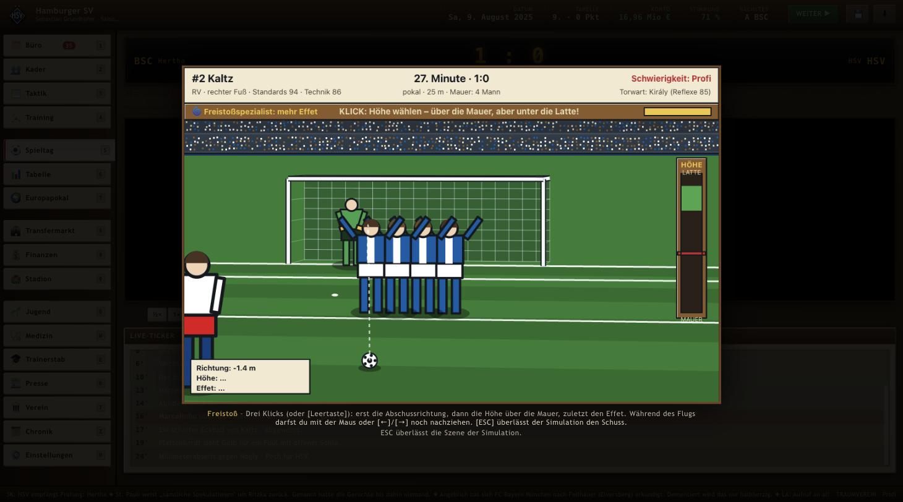
*Der Freistoß: erst Richtung, dann Höhe über die Mauer, zuletzt der Effet.*

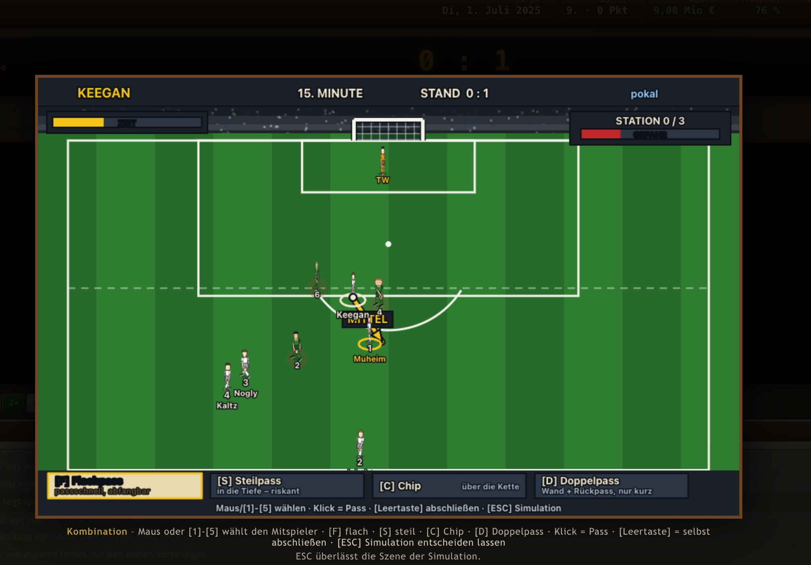
*Die Kombination: Flachpass, Steilpass, Chip oder Doppelpass – drei Stationen bis zum Abschluss.*

### Halbzeit, und danach die Wahrheit

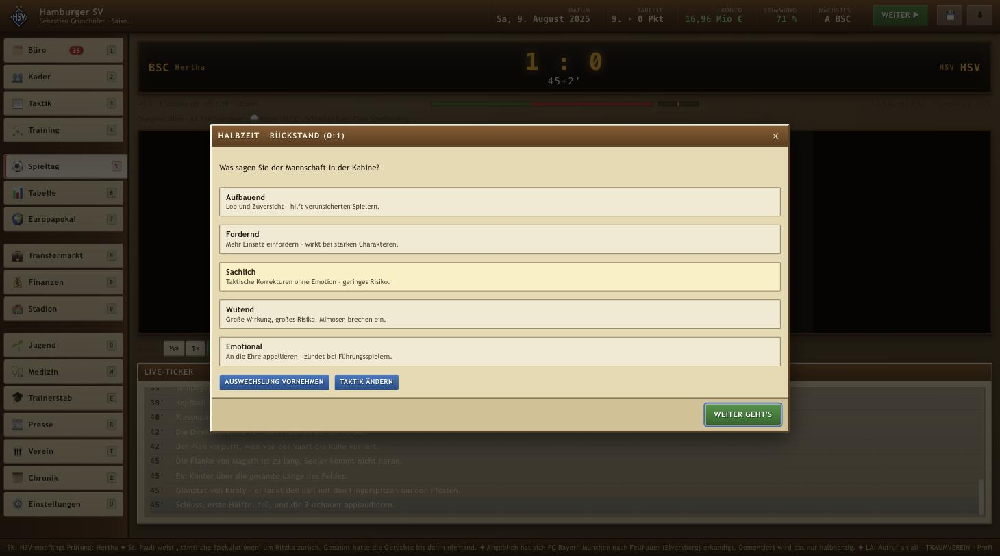
*Rückstand. Fünf Tonlagen, und jede hat ihren Preis – „Wütend" bricht die Mimosen.*

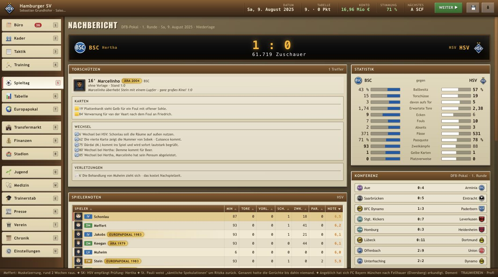
*Torschützen, Karten, Wechsel, Statistik – und die Konferenz der anderen Plätze.*

---

## Die Woche dazwischen

Manager sein heißt Büro, Aktenschrank, Vorstand, Presse. Die Elf ist nur eine von vielen
Baustellen.

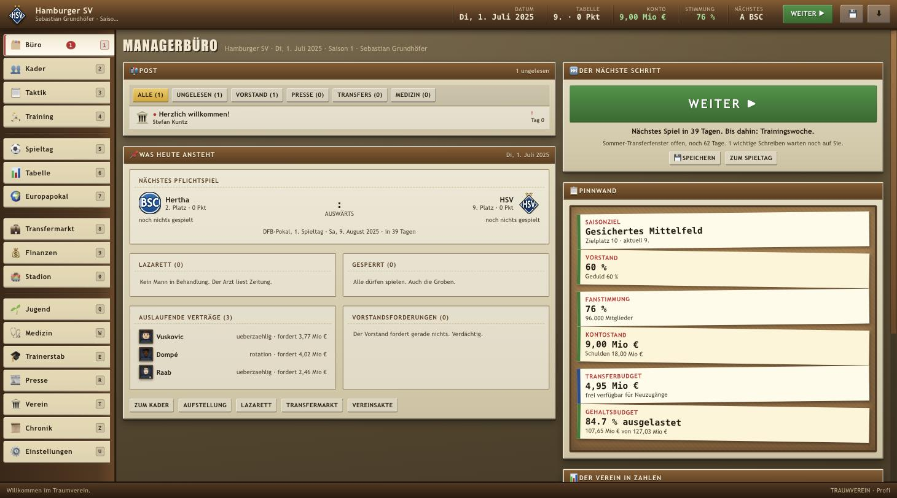
*Post, was heute ansteht, Saisonziel, Geduld des Vorstands, Fanstimmung, Kassenstand.*

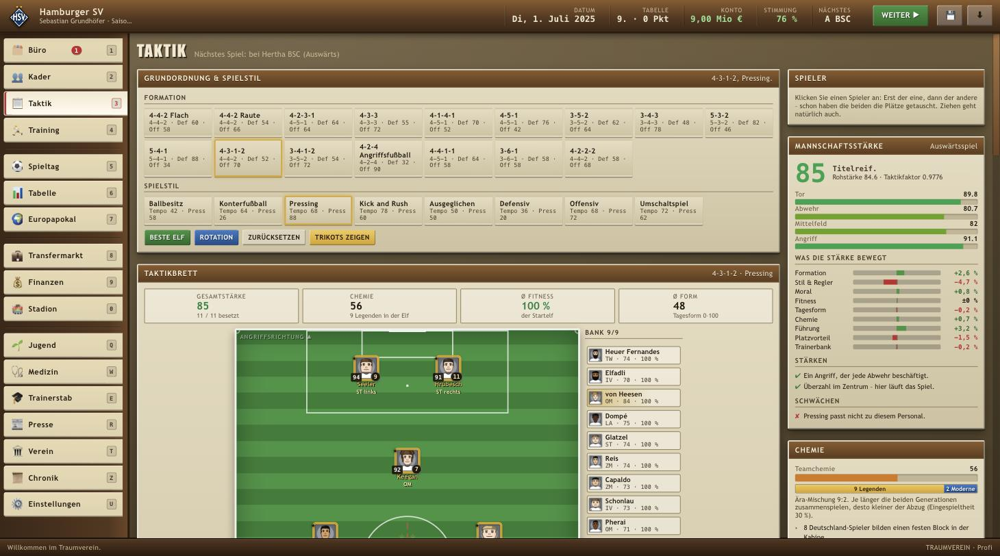
*Zwölf Grundordnungen, acht Spielstile – und eine Anzeige, die aufschlüsselt, was die Stärke bewegt.*

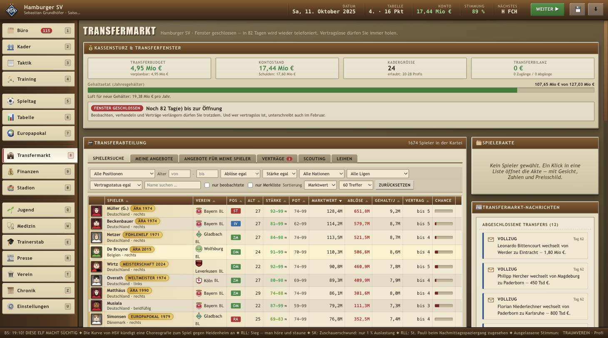
*1674 Spieler in der Kartei. Beckenbauer für 580 Mio – falls der Vorstand mitspielt.*

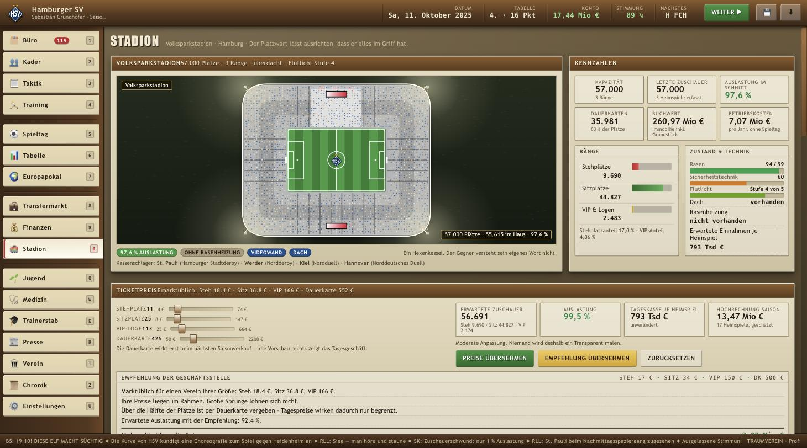
*Ränge, Rasen, Flutlicht, Ticketpreise – und die Empfehlung der Geschäftsstelle, die Sie ignorieren dürfen.*

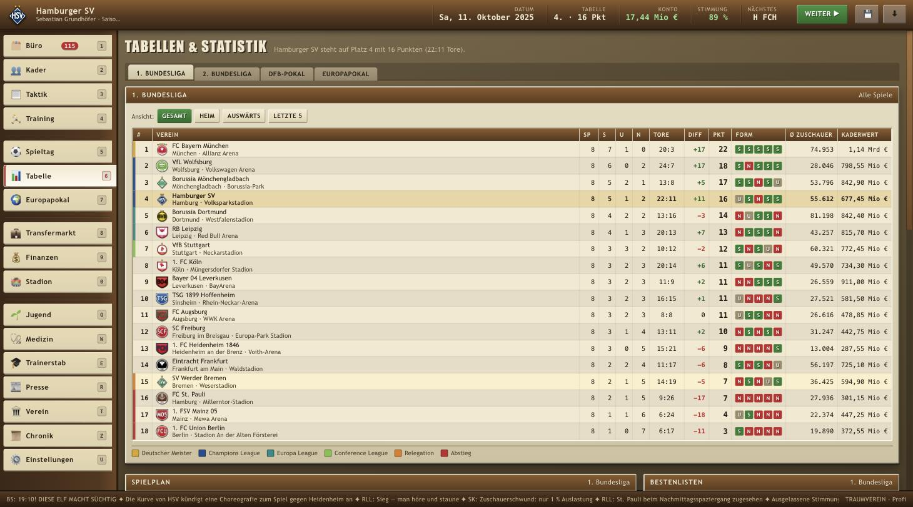
*Am Ende zählt diese Spalte.*

Dazu: Training, Jugend, Medizin, Trainerstab, Presse, Finanzen, Europapokal mit 66
europäischen Vereinen, die Kabine mit Cliquen und Hackordnung – und eine Chronik, die
sich jede Saison merkt.

---

## Starten

**Am einfachsten: [grundhofer.github.io/traumverein](https://grundhofer.github.io/traumverein/)
öffnen und losspielen.** Dieselbe Fassung wie hier im Repository, nur schon ausgeliefert.

**Offline, ohne alles:** die Datei `traumverein.html` aus dem
[neuesten Release](https://github.com/grundhofer/traumverein/releases/latest) laden und im
Browser öffnen. Das ganze Spiel steckt in dieser einen Datei – Module, Grafik, Ton, alle
864 Spieler. Sie braucht einen Browser ab Chrome/Edge 89, Firefox 108 oder Safari 16.4.

> **Eine Einschränkung offline:** Aus einer lokalen Datei geöffnet, verweigert der Browser
> jeder Seite den Zugriff auf seine Datenbank – das Spiel kann dort also nicht in den
> Browser speichern und sagt das auch. Sichern Sie Ihren Stand stattdessen über das Symbol
> ⬇ in der Kopfleiste als Datei; einlesen geht genauso. Wer lieber im Browser speichert,
> spielt online.

Wer es lieber selbst betreibt, braucht keinen Build-Schritt, aber einen Webserver
(ES-Module laufen nicht über `file://`):

```bash
cd fussball
npm start          # oder: node tools/server.js — npm wird nicht gebraucht
```

Dann **`http://localhost:8123`** im Browser öffnen.

> Der mitgelieferte Server schaltet den Browser-Zwischenspeicher ab. `python3 -m http.server`
> tut das nicht und liefert nach Änderungen gern den alten Stand aus.

---

## Spielen

| Taste | Wirkung |
|---|---|
| `1` … `9` | Büro, Kader, Taktik, Training, Spieltag, Tabelle, Europapokal, Transfermarkt, Finanzen |
| `0` | Stadion |
| `Q` `W` `E` `R` `T` | Jugend, Medizin, Trainerstab, Presse, Verein |
| `Z` | Chronik |
| `U` | Einstellungen |
| `Leertaste` / `Enter` | Weiter (Tag/Spieltag) |
| `Strg` + `S` | Speichern |
| `Strg` + `Umschalt` + `E` | Editor |
| `ESC` | Auswahl aufgeben · Dialog schließen · Schlüsselszene der Simulation überlassen · zurück ins Büro |

Die Bildschirme liegen in der Reihenfolge der Aktenleiste auf der Tastatur – erst die
Zahlenreihe, dann die Buchstabenreihe darunter. Kein Bildschirm ohne Kürzel; jedes steht
am rechten Rand seines Reiters und noch einmal vollständig unter **Einstellungen** (`U`).

### Schwierigkeitsgrade

| Grad | Charakter |
|---|---|
| Kreisliga-Legende | Nachsichtiger Vorstand, lockeres Geld, gnädige Minispiele |
| Profi | Die ausgewogene Variante |
| Weltklasse | Knappe Kassen, ungeduldige Bosse, harte Minispiele |
| Legendenstatus | Jeder Fehler zählt |

### Einstellungen

Der Reiter **Einstellungen** sammelt alles, was das Spiel *anfühlt*, aber nichts, was es
*entscheidet*: Ansichtsstufe, Spieltempo, Animationen, Eingreifen samt Auswahl der
Szenenarten, Lautstärke, Stadionatmosphäre, Klänge, Textgeschwindigkeit des Tickers,
Rückfragen bei folgenschweren Aktionen und die automatische Aufstellung. Die Werte hängen
am Spielstand – jede Karriere darf ihre eigenen Vorlieben haben.

### Speichern

Spielstände liegen in der Datenbank des Browsers. Über das Symbol ⬇ in der Kopfleiste
lässt sich ein Stand zusätzlich als Datei sichern und später wieder einlesen; das
überlebt auch das Löschen der Browserdaten.

### Editor (hinter einem Tastenkürzel)

`Strg` + `Umschalt` + `E` öffnet die **Werkstatt**: Vereine (Name, Farben, Trikots, Wappen,
Stadion, Vorstand), Spieler (Stammdaten, Aussehen mit Live-Portrait, alle zwanzig
Attribute, Ära, Vertrag) und komplette Neuanlagen.

Sie steht bewusst nicht in der Aktenleiste: Ein Manager-Spiel lebt davon, dass die Zahlen
gelten, und ein Reiter „Editor" neben „Verein" wäre der Knopf, den man im dritten
Rückstand drückt.

Der Reiter **Austausch** schreibt eine Datei mit *nur* Vereinen und Spielern – kein
Tabellenstand, kein Kassenbuch. Wer seine Kader jemandem geben will, gibt genau diese
Datei weiter und behält seine Karriere für sich. Das ist zugleich die Antwort auf „meine
Kader sind veraltet", ohne dass dieses Spiel je eine Datenquelle aus dem Netz braucht.

---

## Was als Nächstes kommt

**Ära-Konflikte** sind der Punkt, an dem der besondere Dreh aufhört, eine Zahl zu sein.
Wenn eine Legende und ein junger Star aneinandergeraten, stellt die Kabine eine Frage –
*„Wer hat hier recht, der Mann mit den Titeln oder der Mann mit der Zukunft?"* – und es
gibt zwei Antworten, die es sonst nirgends gibt: **„Der Alte hat recht"** kostet die Laune
der ganzen jungen Garde und Ihren Kredit bei ihr, **„Die Zeiten haben sich geändert"**
kostet die Legende monatelang ihr Ansehen in der Kabine. Aussitzen geht auch. Das kostet
am Ende meistens mehr.

---

## Für Entwickler

Das Spiel ist **reines JavaScript, ohne eine einzige Abhängigkeit und ohne Build-Schritt** –
ES-Module, Canvas 2D, ein Server aus Node-Bordmitteln. Was hier liegt, läuft in zehn
Jahren noch, wenn ein Browser es öffnet.

Projektstruktur, Prüfskripte, Ausbaustand und die Grundsätze dahinter stehen in
**[`docs/TECHNIK.md`](docs/TECHNIK.md)**. Die verbindlichen Modulverträge in
[`docs/CONTRACTS.md`](docs/CONTRACTS.md), der Bauverlauf in
[`docs/ROADMAP.md`](docs/ROADMAP.md).
